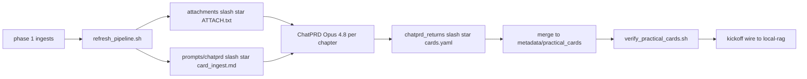

# Practical cards phase 2 — pipeline (deai-operator-corpus pattern)

**Root:** `/Users/dubs/Projects/scholia.skill/literature/cs-ai-textbook-canon/practical_cards_pipeline/`  
**Piranesi mirror:** `/Users/dubs/Projects/piranesi.skill/research-projects/0628-scholia-practical-ingest/phase2-cs-ai/`  
**Architecture canon:** `/Users/dubs/Projects/piranesi.skill/research-projects/0628-scholia-practical-ingest/returns/scholia_practical_ingest_decision_canon_20260626.md`

## Split path (Piranesi vs Scholia)

| Layer | Role | Path |
|-------|------|------|
| **Piranesi S4** | Architecture decision, wave planning mirror | `0628-scholia-practical-ingest/` |
| **Scholia phase 1** | Chapter ingests (claims) | `cs-ai-textbook-canon/ingests/` |
| **Scholia phase 2** | Practical cards (procedures) | `cs-ai-textbook-canon/metadata/practical_cards/` |
| **Consumer** | RAG wire (no re-extract) | `/Users/dubs/Projects/local-rag-linux-setup` |

## Flow

### ChatPRD external (default — mirrors deai-operator-corpus)



### Cursor subagent (alternate)


## ChatPRD external rules (inbuilt)

| Rule | Source |
|------|--------|
| ≤8 uploads per window | piranesi `chatprd-attach-packs.md` · deai `PIPELINE.md` |
| One self-contained `*_ATTACH.txt` per chapter | `build_chatprd_attach_uploads.py` |
| Paste prompt only — never upload `prompts/` | scholia SKILL § ChatPRD upload folders |
| Flat `chatprd_returns/*.yaml` only | operator-path-output iron law |
| No README in attach folders | piranesi verify + operator-path-output |
| Closed corpus — attach text only | scholia amnesiac + piranesi export-only (no Cursor web on primaries) |
| Output schema | `references/practical-usage-schema.md` |

**Operator table:** `references/chatprd-operator-table.md` (regenerated by `emit_chatprd_operator_table.py`)

## Trainer gates (every session)

1. Load `/Users/dubs/.cursor/skills/trainer/SKILL.md` — coach, do not monolith-read.
2. **Plan-first:** read `card_curriculum.yaml` + `orchestrator_status.yaml` before dispatch.
3. **Dispatch gate:** `/Users/dubs/Projects/trainer.skill/references/trainer-dispatch-gates.md` — daily manifest if ≥2 parallel subagents.
4. **Verify before completion:** `/Users/dubs/.cursor/plugins/cache/cursor-public/superpowers/.../verification-before-completion/SKILL.md`

## Operator gates

| Phrase | Action |
| **`kickoff phase 2`** | Run next pending batch from `orchestrator_status.yaml` |
| **`kickoff verify`** | Verify scripts only — no YAML writes |
| **`kickoff wire`** | RAG sync + chunk rebuild + upsert (after verify PASS) |

## Commands

```bash
bash /Users/dubs/Projects/scholia.skill/literature/cs-ai-textbook-canon/practical_cards_pipeline/scripts/refresh_pipeline.sh
bash /Users/dubs/Projects/scholia.skill/literature/cs-ai-textbook-canon/practical_cards_pipeline/scripts/run_practical_cards_review_loop.sh
bash /Users/dubs/Projects/scholia.skill/literature/cs-ai-textbook-canon/practical_cards_pipeline/scripts/run_practical_cards_consumer_wire.sh
bash /Users/dubs/Projects/scholia.skill/scripts/verify_practical_cards_pipeline.sh
```

**Output harness:** `refresh_pipeline.sh` ends with `verify_pipeline.sh` (PC-P01..P14). After each ChatPRD batch: `--batch <id> --require-returns`. Contract: `/Users/dubs/Projects/scholia.skill/references/output-harness-contract.md`

## Orchestrator

Paste only: `/Users/dubs/Projects/scholia.skill/literature/cs-ai-textbook-canon/practical_cards_pipeline/prompts/ORCHESTRATOR_cs_ai_practical_cards.md`

Status SSOT: `/Users/dubs/Projects/scholia.skill/literature/cs-ai-textbook-canon/practical_cards_pipeline/plans/orchestrator_status.yaml`

## Deprecated

- Monolith parent read of all 136 ingests
- Setting `practical_usage_required: true` before cards on disk
- Re-extracting steps in local-rag (read scholia YAML SSOT)
