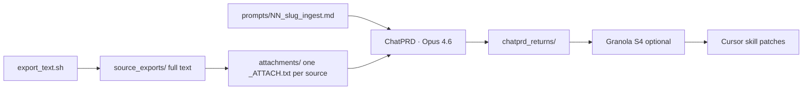

# Attachments — ChatPRD upload folder (upload these only)

**Project:** `/Users/dubs/Projects/scholia.skill/literature/deai-operator-corpus/`

| Folder | Purpose | Upload to ChatPRD? |
| ------ | ------- | ------------------ |
| `attachments/` | One self-contained file per source | **Yes** |
| `source_exports/` | Full pdftotext/Calibre exports (chapter fan-out, re-slice) | **No** |
| `prompts/` | Paste into ChatPRD (not attached as file unless you choose) | Paste only |

## Naming

**Papers (01–04):** `{order}_{slug}_ATTACH.txt` — full export embedded.

**Textbooks (chapter fan-out):** `{prefix}_{chapter_id}_ATTACH.txt` — one curated chapter per file.

Example: `prompts/05_baker_2020_prof_writing_speaking_ch07_ingest.md` ↔ `attachments/05_baker_2020_prof_writing_speaking_ch07_ATTACH.txt`

Curriculum: `/Users/dubs/Projects/scholia.skill/literature/deai-operator-corpus/chapter_curriculum.yaml`

Each `_ATTACH.txt` embeds **stable-context** + **primary text**. Chapter slices under 119k chars embed in full; longer chapters truncate with note pointing to `source_exports/chapters/`.

## Workflow

| Step | Action |
| ---- | ------ |
| Export | `bash /Users/dubs/Projects/scholia.skill/literature/deai-operator-corpus/scripts/export_text.sh` |
| ChatPRD | Attach **one** `attachments/NN_slug_ATTACH.txt` + paste matching `prompts/NN_slug_ingest.md` |
| S2–S4 | ChatPRD synthesis prompts in `prompts/synth_*.md` — attach live ingests from `chatprd_returns/` |
| Save | `chatprd_returns/{slug}_YYYYMMDD_ingest.md` |

**Cursor does NOT author ingests.**

## Example (corpus_3375627)

1. Attach: `/Users/dubs/Projects/scholia.skill/literature/deai-operator-corpus/attachments/01_corpus_3375627_ATTACH.txt`
2. Paste: `/Users/dubs/Projects/scholia.skill/literature/deai-operator-corpus/prompts/01_corpus_3375627_ingest.md`
3. Save: `/Users/dubs/Projects/scholia.skill/literature/deai-operator-corpus/chatprd_returns/corpus_3375627_YYYYMMDD_ingest.md`

## Piranesi sibling

Wave S1–S4 batch path (separate): `/Users/dubs/Projects/piranesi.skill/research-projects/0630-deai-operator-corpus/ATTACHMENTS.md`

Per-source ChatPRD ingests use **this** scholia project; Piranesi `attachments/` mirrors upload files only.

## Cursor implement wave (orchestrator)

| Artifact | Path |
| -------- | ---- |
| Orchestrator prompt | `/Users/dubs/Projects/scholia.skill/literature/deai-operator-corpus/prompts/ORCHESTRATOR_deai_tic_corpus.md` |
| Status SSOT | `/Users/dubs/Projects/scholia.skill/literature/deai-operator-corpus/plans/orchestrator_status.yaml` |
| Worker index | `/Users/dubs/Projects/scholia.skill/literature/deai-operator-corpus/prompts/workers/README.md` |
| Skill worker 01 (example) | `/Users/dubs/Projects/scholia.skill/literature/deai-operator-corpus/prompts/workers/worker_01_deai_signals_patch.md` |
