# Prompt pipeline — deai-operator-corpus (single ingest + ChatPRD synthesis)

**No Piranesi S2/S3/S4 re-runs.** One ingest per source → ChatPRD synthesis → Cursor Composer 2.5 implements.

**Root:** `/Users/dubs/Projects/scholia.skill/literature/deai-operator-corpus/prompts/`

## Flow

```mermaid
flowchart LR
  A["attachments/NN_ATTACH.txt"] --> B["ChatPRD S1 ingest"]
  P["prompts/NN_*_ingest.md"] --> B
  B --> C["chatprd_returns/slug_*_ingest.md"]
  C --> D["synth_attach merge windows"]
  D --> E["/Users/dubs/Projects/scholia.skill/literature/deai-operator-corpus/prompts/synth_corpus_evidence_digest.md"]
  E --> F["/Users/dubs/Projects/scholia.skill/literature/deai-operator-corpus/prompts/synth_corpus_skill_brief.md"]
  F --> G["/Users/dubs/Projects/scholia.skill/literature/deai-operator-corpus/prompts/synth_cursor_implement_brief.md"]
  G --> H["cursor_implement_brief_*.md"]
  H --> I["Cursor Composer 2.5 patches deai/tic"]
```

## Step 1 — Ingest (done / live in chatprd_returns)

**Operating mode (tokenopt v0.2):** Semantic preservation protocol — quote-first, row-not-prose, provenance chain. Contract: `/Users/dubs/Projects/scholia.skill/literature/deai-operator-corpus/prompts/CORPUS_SYNTH_CONTRACT.md` · Research: `/Users/dubs/Projects/scholia.skill/literature/deai-operator-corpus/localonly/research/opus46-synthesis-scratchpad.md`

| Platform | Prompt | Attach | Save |
| -------- | ------ | ------ | ---- |
| ChatPRD | `{prefix}_*_ingest.md` or `{prefix}_{chapter_id}_ingest.md` | `attachments/{prefix}_ATTACH.txt` or `{prefix}_{chapter_id}_ATTACH.txt` | `chatprd_returns/{slug}_*_ingest.md` |

### Step 1b — Chapter fan-out (textbooks)

| Item | Path |
| ---- | ---- |
| Curriculum | `/Users/dubs/Projects/scholia.skill/literature/deai-operator-corpus/chapter_curriculum.yaml` |
| Slices | `source_exports/chapters/{prefix}_{chapter_id}.txt` |
| Upload | `attachments/{prefix}_{chapter_id}_ATTACH.txt` |
| Prompt | `prompts/{prefix}_{chapter_id}_ingest.md` |

**Option A (EPUB):** `python3 scripts/split_epub_chapters.py` when inbox EPUB present (`split_mode: epub_spine` in curriculum). **Byte-offset / pattern:** `python3 scripts/split_chapters.py` — `start_pattern` + `start_min_offset` preferred over wrong `start_offset` (Terk lesson07 body; Long Parts I–V).

**Long 2018 deai priority:** Part III (sentence/paragraph) > Parts I, IV > Part II > Part V (process scaffolding). See curriculum `ingest_priority` fields.

Rebuild: `python3 scripts/split_epub_chapters.py && python3 scripts/split_chapters.py && python3 scripts/build_attach_uploads.py && python3 scripts/generate_chapter_prompts.py`

## Step 2 — Per-source refine (evidence filter · **skipped when ingest adversarially reviewed**)

When operator has already adversarially reviewed each ingest return, **skip Phase 2** — do not emit per-slug refine packs or `_refined_*.md`. Proceed directly to Phase 3 merge windows with raw `*_ingest.md` attaches.

When Phase 2 runs (legacy / unreviewed ingests): apply semantic preservation protocol before kill/score. Gate A verification pass required.

| Platform | Prompt | Attach |
| -------- | ------ | ------ |
| ChatPRD | `/Users/dubs/Projects/scholia.skill/literature/deai-operator-corpus/prompts/synth_refine_per_source.md` | saved ingest + Gate A attach + optional contract |

## Step 2b — Corpus evidence digest (Phase 3 · high-evidence merge)

**Operator chat table (current phase only):** `/Users/dubs/Projects/scholia.skill/literature/deai-operator-corpus/references/synthesis-operator-table.md`  
**Build merge-window packs:** `python3 /Users/dubs/Projects/scholia.skill/literature/deai-operator-corpus/scripts/build_synth_attach_packs.py --clean`

**Regenerate table:** `python3 /Users/dubs/Projects/scholia.skill/literature/deai-operator-corpus/scripts/build_synth_attach_packs.py --clean && python3 /Users/dubs/Projects/scholia.skill/literature/deai-operator-corpus/scripts/emit_synthesis_operator_table.py`

**Supplemental web verification** allowed to resolve cross-source conflicts on external facts or confirm load-bearing STRONG claims (palamedes bar; ≤5 searches/window). Gate A carry-forward mandatory.

| Platform | Prompt | Attach |
| -------- | ------ | ------ |
| ChatPRD | `/Users/dubs/Projects/scholia.skill/literature/deai-operator-corpus/prompts/synth_corpus_evidence_digest.md` | **Attach:** `00_CORPUS_SYNTH_CONTRACT.md` (MUST READ) + ≤7 ingests from `synth_attach/{window_id}/`. **Paste:** digest prompt only. Manifest: `localonly/phase3_window_manifests/{window_id}.md` |

Surviving claims only; NEEDS_REVIEW rows: claim | full context | primary path | quotes. Operator PASS before implement.

## Step 3 — Corpus skill brief (optional batch)

| Platform | Prompt | Attach | Save |
| -------- | ------ | ------ | ---- |
| ChatPRD | `/Users/dubs/Projects/scholia.skill/literature/deai-operator-corpus/prompts/synth_corpus_skill_brief.md` | up to 8 evidence digest(s) per window | `deai_operator_corpus_skill_brief_*.md` |

## Step 4 — Cursor handoff

| Platform | Prompt | Attach | Save |
| -------- | ------ | ------ | ---- |
| ChatPRD | `/Users/dubs/Projects/scholia.skill/literature/deai-operator-corpus/prompts/synth_cursor_implement_brief.md` | skill brief or single refined digest | `cursor_implement_brief_YYYYMMDD.md` |

## Step 5 — Implement (Cursor only — orchestrator-first)

**Do not use monolithic AGENT prompts for heavy context.** Use orchestrator dispatch + focused workers (≤4 read paths each; agent reads from disk).

| Role | Path | When |
| ---- | ---- | ---- |
| **Orchestrator** (dispatch only) | `/Users/dubs/Projects/scholia.skill/literature/deai-operator-corpus/prompts/ORCHESTRATOR_deai_tic_corpus.md` | Refined digests + four-source batch on disk |
| Status SSOT | `/Users/dubs/Projects/scholia.skill/literature/deai-operator-corpus/plans/orchestrator_status.yaml` | Operator updates after each worker |
| Worker index | `/Users/dubs/Projects/scholia.skill/literature/deai-operator-corpus/prompts/workers/README.md` | Dependency graph + attach budgets |

### Skill lane (workers 01–05, run first)

| Worker | Prompt | Touch |
| ------ | ------ | ----- |
| 01 | `prompts/workers/worker_01_deai_signals_patch.md` | deai SKILL signals |
| 02 | `prompts/workers/worker_02_deai_craft_theory_ethics.md` | craft-theory-reference + McKee ethics |
| 03 | `prompts/workers/worker_03_tic_message_craft.md` | tic Locker moves |
| 04 | `prompts/workers/worker_04_tic_voice_enrichment.md` | tic Long + Lu & Ai moves |
| 05 | `prompts/workers/worker_05_verification_grep.md` | grep + pytest + status update |

Workers 02 and 03 may run **in parallel** after worker 01. Worker 04 is serial after 03.

### Pipeline lane (workers 10–13, after skill lane PASS)

| Worker | Prompt | Touch |
| ------ | ------ | ----- |
| 10 | `prompts/workers/worker_10_scholia_pipeline_docs.md` | PIPELINE, ATTACHMENTS, INDEX |
| 11 | `prompts/workers/worker_11_piranesi_0630_mirror.md` | Piranesi 0630 separation |
| 12 | `prompts/workers/worker_12_ingest_prompt_templates.md` | synth brief + chapter generator |
| 13 | `prompts/workers/worker_13_evergreen_mdc_rule.md` | optional MDC rule |

Workers 10 and 11 may run **in parallel** after worker 05.

**Redirects (bookmarks):** `AGENT_01_implement_skill_patches.md`, `AGENT_02_piranesi_scholia_composer_hardening.md`

Also: paste `cursor_implement_brief_*.md` into Composer 2.5 / Auto pool when using ChatPRD handoff chain.

**Kickoff (superset wave):** `/Users/dubs/Projects/scholia.skill/literature/deai-operator-corpus/prompts/KICKOFF_ORCHESTRATOR_corpus_extraction_wave.md` — daily log manifest, trainer gates per phase, verify loop.

**Preprocess:** Section 3 of `prompts/evergreen_chatprd_composer_ingest.md` — transform Opus synthesis into Composer-safe DIRECTIVE blocks before Cursor ingest.

**Context budget:** ≤8 attach per ChatPRD window · ≤4 read paths per Cursor worker · contract: `/Users/dubs/Projects/scholia.skill/literature/deai-operator-corpus/prompts/CORPUS_SYNTH_CONTRACT.md`

**Regen ingests:** `rewrite_chatprd_prompts.py` + `generate_chapter_prompts.py` — **skips prompts with saved** `chatprd_returns/*_ingest.md`. Frozen prompts: `restore_legacy_ingest_prompts.py`.

Cursor does not re-ingest primaries.

## Per-source quick map

| Prefix | Slug | Ingest prompt | Phase 3 window |
| ------ | ---- | ------------- | -------------- |
| 01 | corpus_3375627 | `01_corpus_3375627_ingest.md` | `3A_deai_long_papers` |
| 02 | jones_2015_jslw | `02_jones_2015_jslw_ingest.md` | `3A_deai_long_papers` |
| 03 | s00146_2024_ai_writing | `03_s00146_2024_ai_writing_ingest.md` | `3A_deai_long_papers` |
| 04 | s40979_2024_ai_writing | `04_s40979_2024_ai_writing_ingest.md` | `3A_deai_long_papers` |
| 05–13 | textbooks | `05_*` … `13_*` | see `PHASE3_WINDOWS` in `scripts/build_synth_attach_packs.py` |

## Deprecated (do not use for this corpus)

Piranesi multi-stage / Granola S4 prompts removed from this workflow. Detection canon inherit: `/Users/dubs/Projects/piranesi.skill/research-projects/0628-deai-signal-removal/deai-signal-removal_decision_canon.md`
