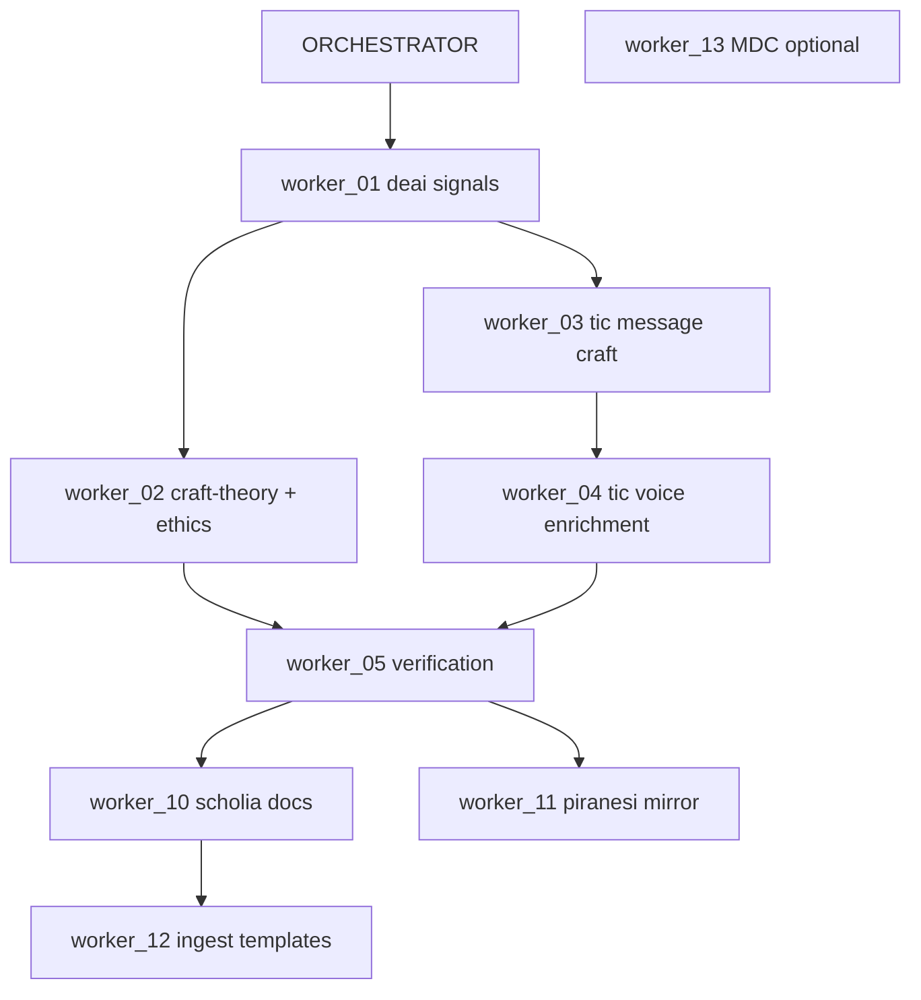

# Worker prompts — deai-operator-corpus implement wave

**Orchestrator:** `/Users/dubs/Projects/scholia.skill/literature/deai-operator-corpus/prompts/ORCHESTRATOR_deai_tic_corpus.md`  
**Contract:** `/Users/dubs/Projects/scholia.skill/literature/deai-operator-corpus/prompts/CORPUS_SYNTH_CONTRACT.md`  
**Status SSOT:** `/Users/dubs/Projects/scholia.skill/literature/deai-operator-corpus/plans/orchestrator_status.yaml`  
**Plan:** `/Users/dubs/Projects/scholia.skill/literature/deai-operator-corpus/plans/deai_tic_skill_incorporation_plan.md`

Monolith redirects (bookmarked): `AGENT_01_implement_skill_patches.md`, `AGENT_02_piranesi_scholia_composer_hardening.md`

---

## Worker count

| Lane | Workers | Optional |
| ---- | ------- | -------- |
| Skill (deai/tic patches) | 5 (01–05) | — |
| Pipeline (scholia + Piranesi hardening) | 4 (10–13) | worker 13 |
| **Total** | **9** (+ 1 optional) | |

Chapter ingests (Baker ch07, Locker ch08) are **operator ChatPRD** tasks — not Composer workers in this wave.

---

## Dependency graph

---

## Dispatch order (orchestrator serial default)

1. `worker_01_deai_signals`
2. **`worker_02_deai_craft_theory_ethics` ∥ `worker_03_tic_message_craft`** (parallel after 01)
3. `worker_04_tic_voice_enrichment`
4. `worker_05_verification_grep`
5. **`worker_10_scholia_pipeline_docs` ∥ `worker_11_piranesi_0630_mirror`** (parallel after 05)
6. `worker_12_ingest_prompt_templates`
7. `worker_13_evergreen_mdc_rule` (optional, any time)

---

## Context budgets

| Role | How context arrives | Max |
| ---- | ------------------- | --- |
| Orchestrator (Cursor) | Agent reads paths from disk | 3 paths |
| Composer worker (Cursor) | Agent reads paths from disk | 4 paths |
| ChatPRD ingest (external) | **Operator attaches** files to Opus window | 8 files |

Workers **must not** read primaries, full chapter slices, or monolith `*_ingest.md` unless the worker prompt lists them.

---

## Parallel vs serial lanes

| Parallel group | Workers | Constraint |
| -------------- | ------- | ---------- |
| **A** | 02 + 03 | Both require 01 done; touch different skill files |
| **B** | 10 + 11 | Both require 05 done; scholia docs vs piranesi mirror |
| Serial | 01 → (02∥03) → 04 → 05 → (10∥11) → 12 | 04 waits for 03 (same tic/SKILL.md) |

Do **not** run worker 04 in parallel with worker 03.

---

## Worker index

| Key | Prompt | Touch paths |
| --- | ------ | ----------- |
| worker_01_deai_signals | `worker_01_deai_signals_patch.md` | `/Users/dubs/.cursor/skills/deai/SKILL.md` |
| worker_02_deai_craft_theory_ethics | `worker_02_deai_craft_theory_ethics.md` | `/Users/dubs/.cursor/skills/deai/craft-theory-reference.md` |
| worker_03_tic_message_craft | `worker_03_tic_message_craft.md` | `/Users/dubs/.cursor/skills/tic/SKILL.md` (PATCH 2 part A) |
| worker_04_tic_voice_enrichment | `worker_04_tic_voice_enrichment.md` | `/Users/dubs/.cursor/skills/tic/SKILL.md` (PATCH 2 part B) |
| worker_05_verification_grep | `worker_05_verification_grep.md` | status yaml + grep/pytest only |
| worker_10_scholia_pipeline_docs | `worker_10_scholia_pipeline_docs.md` | PIPELINE, ATTACHMENTS, INDEX |
| worker_11_piranesi_0630_mirror | `worker_11_piranesi_0630_mirror.md` | piranesi 0630 ATTACHMENTS, manifest |
| worker_12_ingest_prompt_templates | `worker_12_ingest_prompt_templates.md` | synth brief, generate_chapter_prompts.py |
| worker_13_evergreen_mdc_rule | `worker_13_evergreen_mdc_rule.md` | `.cursor/rules/research-context.mdc` |

---

## Split rationale (vs monolith AGENT_01)

| Original task | Worker | Notes |
| ------------- | ------ | ----- |
| PATCH 1 → deai SKILL | 01 | Signals + kill list only |
| PATCH 1 bibliography + McKee ethics | 02 | Renamed from "calibration" — org-resistance calibration is tic worker 03 |
| PATCH 2 Locker moves | 03 | "Cover letter" hooks deferred; message craft only |
| PATCH 2 Long + Lu & Ai + kill list | 04 | Voice enrichment |
| Checklist + pytest | 05 | Centralized verify |

---

## Operator loop

1. New Cursor orch chat → paste ORCHESTRATOR prompt (agent reads plan + status yaml + this README from disk)
2. Run dispatched worker in **fresh** Composer chat — paste worker prompt only (agent reads listed paths)
3. Verify → update `orchestrator_status.yaml`
4. Re-run orchestrator until pipeline lane complete

**ChatPRD only:** operator attaches files to external Opus window (see `PIPELINE.md`).
