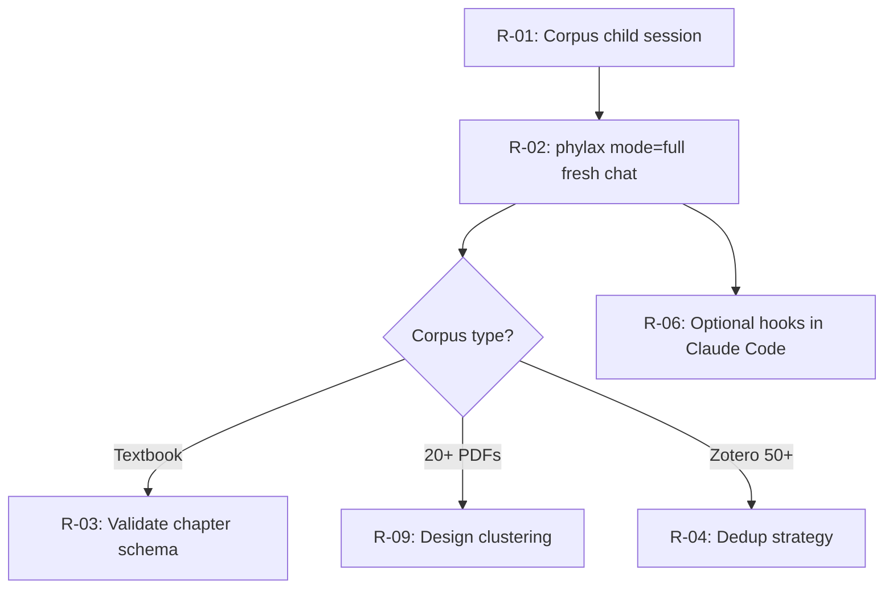

# Scholia — roadmap & remaining tasks (ELI15)

META: operator handoff · date=2026-06-18 · platform=v0.2.1 CANON-SHIPPED

**What this file is:** Everything still on the to-do list, plus what already shipped — explained simply.

**Parent roadmap (checkbox history):** `/Users/dubs/Projects/scholia.skill/references/ROADMAP-v0.2.md`

**Latest audit:** `/Users/dubs/Projects/piranesi.skill/research-projects/0621-scholia-corpus/returns/trainer-reviews/scholia-v0.2.1-comprehensive-audit-20260618.md`

---

## The one-sentence version

**Scholia** is the “librarian robot” that takes your PDF pile, breaks it into bite-sized notes, checks its work, and hands off to other tools (study guides, cheat sheets, etc.). The **platform** in this repo is built and passing tests. What’s left is mostly **using it on a real topic** and a few **nice-to-have upgrades**.

---

## What already shipped (you can ignore unless curious)

| Version | What it means (ELI15) |
|---------|------------------------|
| **v0.1.1** | Basic plumbing: how to ingest papers, folder layout, test scripts, README. |
| **v0.2.0** | Three new “output modes” (study guide, how-to guide, NotebookLM pack) + cross-check script + piranesi export-only guard. |
| **v0.2.1** | Research decisions merged into SKILL.md, kill-register, CLAIMS; canonical S2 saved; doc audit done. All automated tests **pass**. |

Mechanical verify (the robot’s self-check):

```bash
bash /Users/dubs/Projects/scholia.skill/scripts/run_trainer_review_loop.sh
```

---

## Remaining tasks — quick pick list

| # | Task | Who | When |
|---|------|-----|------|
| **R-01** | First real **corpus child** `*.skill/` | **You** (operator) | Next session — name PDFs + output mode |
| **R-02** | **phylax mode=full** on that child draft | **You** (fresh chat) | Right after R-01 |
| **R-03** | Textbook schema validation (Q-006 / gap #1) | v0.3+ | When you ingest a textbook |
| **R-04** | Zotero dedup at 50+ items (gap #4) | v0.3+ | Big Zotero libraries |
| **R-05** | Token budget vs `references/` (gap #6) | v0.3+ | Huge child skills |
| **R-06** | Hooks actually wired in Claude Code (gap #8) | **You** (optional) | When shipping a child |
| **R-07** | Closed-corpus + piranesi edge cases (gap #9) | **DOC shipped** | Policy stub on disk |
| **R-08** | Better wc↔token math (gap #11) | PARTIAL | Approx doc shipped |
| **R-09** | N>20 PDF clustering fallback | **DOC shipped** | Design stub on disk |
| **R-10** | PS-02 / SF-11 auto-warn (PDF vs ingest count) | **SHIPPED** | verify + PS-02 oracle |
| **R-11** | SF-09 shellcheck on scripts | **SHIPPED** | verify --self |
| **R-12** | Child template extra sections (Permissions, Handoff…) | **SHIPPED** | Sections 9–12 |
| **R-13** | Frozen pressure fixtures on disk (wave 5) | **SHIPPED** | run_fixtures.sh |
| **R-14** | Save condense bundle for audit trail | **SHIPPED** | granola_attach_bundle |
| **R-15** | Re-enable mechanical DRM checks | Optional | Only if you revoke DRM waive |

---

## Remaining tasks — full ELI15 write-up

### R-01 · Operator corpus child `*.skill/` session

**Status:** OPEN · **blocking for “real use”** · **out of this repo**

**ELI15:** Scholia is the **recipe book** for deep-parse ingests. R-01 ran on flirt papers but merged into **aletheia** (satellite deleted 2026-06-19). Next cakes: workbook/qual chapter indexes per `aletheia.skill/references/scholia-ingest-plan.md`.

**What you do:** New chat → drop PDFs in `literature/pdfs/` (or your corpus path) → say output mode (`skill`, `study-guide`, `procedural`, `notebooklm-pack`) → scholia runs ingest → synthesis → child SKILL.md from `/Users/dubs/Projects/scholia.skill/references/child-skill-template.md`.

**Why it’s out of repo:** Generated skills belong to *your* corpus, not the scholia platform repo.

---

### R-02 · phylax `mode=full` on child SKILL draft

**Status:** DEFERRED · **do after R-01** · separate chat (Q-014)

**ELI15:** `verify_scholia.sh` is a **spell-checker** — catches missing fields, bad paths, word limits. **phylax mode=full** is a **teacher reading your essay** — “does this claim actually match the sources?” You can’t grade your own homework in the same sitting, so this runs in a **fresh chat** (`context:fork`), not the chat that wrote the skill.

**Checklist:** `/Users/dubs/Projects/scholia.skill/references/phylax-preflight-s4.md`

**Parent platform phylax:** Already **pass** (`audit_repo` on scholia.skill). This item is only for the **generated child**.

---

### R-03 · Gap #1 — Textbook schema (Q-006)

**Status:** OPEN · v0.3+ · **UNTESTED**

**ELI15:** Journal papers and textbook chapters are shaped differently (exercises, sections, problem sets). We have a **chapter-ingest prompt**, but nobody has run a real textbook through it and proved the output is good. It’s like having a form for “book report” that hasn’t been filled out with a real book yet.

**Trigger:** First time you ingest a textbook chapter corpus.

**Related file:** `/Users/dubs/Projects/scholia.skill/prompts/literature-chapter-ingest.md`

---

### R-04 · Gap #4 — Zotero dedup at 50+ items

**Status:** OPEN · v0.3+

**ELI15:** If you pull 50+ papers from Zotero, you might get **duplicates** (same paper, different entry). We documented the Zotero hookup but didn’t build automatic “hey, these two are the same paper” logic for big libraries.

**Related file:** `/Users/dubs/Projects/scholia.skill/references/zotero-mcp-workflow.md`

---

### R-05 · Gap #6 — Token budget vs `references/`

**Status:** OPEN · v0.3+

**ELI15:** Child skills have a **size limit** (roughly: keep SKILL.md under 500 lines; heavy stuff goes in `references/`). We haven’t fully tested what happens when `references/` gets **huge** — will the agent still “see” what it needs, or drown in files?

**Trigger:** Child skill with very large reference trees.

---

### R-06 · Gap #8 — Hooks wired in Claude Code

**Status:** PARTIAL · doc stub **shipped** · wiring **on you**

**ELI15:** **Hooks** are automatic reminders — e.g. “when the agent finishes, run verify” or “before reading the 6th PDF, warn about monolith-read.” We wrote the **instruction sheet** but didn’t plug it into your Claude Code settings for you (that’s machine-specific).

**Doc stub:** `/Users/dubs/Projects/scholia.skill/references/hooks-config.md`

**When:** Optional when you ship a corpus child you’ll use daily.

---

### R-07 · Gap #9 — Closed-corpus + piranesi routing

**Status:** OPEN · v0.3+ · research/policy

**ELI15:** Some corpora are **private** (NDA, internal docs). Piranesi normally means “export research to ChatPRD/Granola, no web in Cursor.” Edge cases — when is export OK vs not, how to log waives — aren’t fully spelled out for every closed-corpus scenario.

**Related:** `/Users/dubs/Projects/scholia.skill/references/negative-space.md` (refusal categories)

---

### R-08 · Gap #11 — wc-to-token ratio (better math)

**Status:** PARTIAL · approx doc **shipped** · precise math **open**

**ELI15:** The verify script counts **lines** and **words**, not exact **tokens** (how Claude bills/compacts). We wrote a rule-of-thumb (~0.75 tokens per word) but it’s a **guess**, not vendor-specified. Fine for v0.2.1; might matter if you’re hugging the 5k compaction cliff.

**Doc:** `/Users/dubs/Projects/scholia.skill/references/wc-to-token-approximation.md`

---

### R-09 · N>20 clustering fallback

**Status:** OPEN · v0.3+

**ELI15:** Fan-out means “one sub-agent per paper.” If you drop **20+ PDFs**, that gets messy. The plan was a **clustering fallback** (group similar papers, fewer agents) — decided to **defer** until someone actually has a 20+ corpus.

**Source:** `/Users/dubs/Projects/scholia.skill/references/s4-open-decisions.md` (N>20 row)

---

### R-10 · PS-02 / SF-11 — PDF count vs ingest count auto-warn

**Status:** DEFERRED · doc-only · v0.3+ harness

**ELI15:** If you have 5 PDFs but only 4 ingest files, something might be missing. The **design** says that should WARN; the **script** doesn’t check yet — only documented in pressure scenarios.

**Related:** `/Users/dubs/Projects/scholia.skill/references/pressure-scenarios.md` (PS-02 row)

---

### R-11 · SF-09 — shellcheck on scripts

**Status:** DEFERRED · doc-only · v0.3+ harness

**ELI15:** **shellcheck** is a linter for bash scripts (catches common shell bugs). Nice to have; not wired into verify yet. Platform scripts work; this is polish.

**Related:** `/Users/dubs/Projects/scholia.skill/references/contract-graph.md` (SF-09 row)

---

### R-12 · Child template extra sections (v0.3)

**Status:** OPEN · v0.3+ · template polish

**ELI15:** The child skill template has the **must-have** sections (iron laws, when to use, workflow, evidence). Optional sections — Permissions, Human gates, Handoff, Audience — were pushed to **v0.3** so v0.2 didn’t bloat every generated skill.

**File:** `/Users/dubs/Projects/scholia.skill/references/child-skill-template.md`

---

### R-13 · Frozen pressure fixtures on disk (wave 5)

**Status:** OPTIONAL · **waived** for v0.2

**ELI15:** Tests for “bad child skill” scenarios live **inside** the verify script (temporary folders). Wave 5 would copy them to real files under `tests/pressure_scenarios/fixtures/` for easier editing. **Not required** — inline tests already pass 10/10.

---

### R-14 · Save condense bundle (audit trail)

**Status:** OPTIONAL · one-time

**ELI15:** During wave 9, ChatPRD “condense” output might have been ephemeral. Saving it to `piranesi.skill/research-projects/0621-scholia-corpus/returns/granola_attach_bundle_20260618.md` is **archaeology** — nice for audit, not needed to ship.

---

### R-15 · Re-enable mechanical DRM verification

**Status:** WAIVED · operator 2026-06-18

**ELI15:** **DRM** = copy protection on PDFs (watermarks, “don’t copy”). Canon says track it in the manifest; **automatic** DRM detection in verify was **turned off** by your choice. You can turn it back on later if you want the robot to fail on locked PDFs.

**Related:** `/Users/dubs/Projects/scholia.skill/references/negative-space.md`

---

## Explicitly not doing (in this repo)

| Item | ELI15 why |
|------|-----------|
| Domain child skills in `scholia.skill/` | That’s like storing your homework inside the teacher’s answer key folder. Child skills live elsewhere. |
| ChatPRD rerun of base S2 | Already saved as Cursor fold — no need to pay for another ChatPRD pass. |
| Editing historical research ingests (S1 gymbuddy prose) | Old research notes; changing them would rewrite history. Shippable docs already say `context:fork` instead. |

---

## Suggested order (what to do next)



1. **R-01** — pick a real corpus + output mode (biggest unlock). Kickoff packet: `/Users/dubs/Projects/scholia.skill/prompts/r01-corpus-session-banter-kickoff.md`
2. **R-02** — phylax semantic on that child (fresh chat).
3. Everything else — only when the corpus **actually needs** it.

---

## Navigation (absolute paths)

| What | Path |
|------|------|
| This file | `/Users/dubs/Projects/scholia.skill/references/ROADMAP-remaining-tasks.md` |
| Shipped roadmap | `/Users/dubs/Projects/scholia.skill/references/ROADMAP-v0.2.md` |
| Platform SKILL | `/Users/dubs/Projects/scholia.skill/SKILL.md` |
| Open decisions (S3 §8) | `/Users/dubs/Projects/scholia.skill/references/s4-open-decisions.md` |
| Canon gaps list | `/Users/dubs/Projects/piranesi.skill/research-projects/0621-scholia-corpus/returns/scholia_decision_canon_20260618.md` §Remaining open gaps |
| Child template | `/Users/dubs/Projects/scholia.skill/references/child-skill-template.md` |
| Verify harness | `/Users/dubs/Projects/scholia.skill/scripts/verify_scholia.sh` |
| Trainer autonomous gate | `/Users/dubs/Projects/scholia.skill/scripts/run_trainer_review_loop.sh` |

---

## Status snapshot (2026-06-18)

| Track | Verdict |
|-------|---------|
| Platform in-repo | **DONE** — harness v0.3 hardening shipped |
| Research / canon merge | **DONE** — v0.2.1 |
| First real use | **OPEN** — R-01 |
| Operator / corpus-bound | **OPEN** — R-01, R-02, R-03–R-06 when corpus exists |
| Optional / waived | **YOUR CALL** — R-15 |
